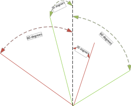
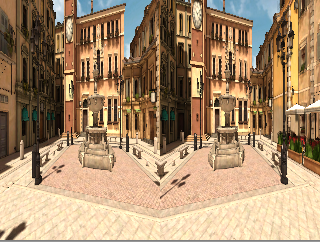
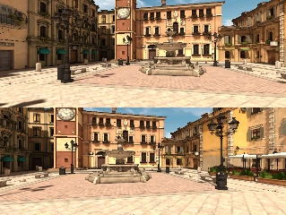
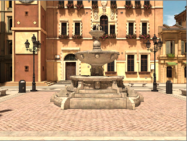
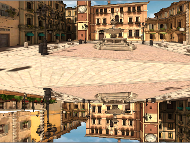

# Structure of JSON descriptor file (v1) for HMDs


This document describes the structure of the descriptor files for OSVR HMDs. It does so in the context of an example file covering the zSight 1920-100. This example file is available as part of the OSVR distribution. 

Since not all JSON parsers (notably the Python JSON parser) accept C-style comments, we opted to provide description in a standalone document. You can also consult the JSON-Schema file.

The file starts with a schema version indicator, and then the main `hmd` object is opened.

```json
{
  "meta": {
    "schemaVersion": 1
  },
  "hmd": {
```

The `device` section does not have an impact on the way the image is rendered. It provides information that might be used in displaying the selected HMD, building a catalog of available HMDs, and so forth.


```json
    "device": {
      "vendor": "Sensics",
      "model": "zSight 1920-100",
      "Version": "",
      "Note": ""
    },
```

The *`field_of_view`* section defines the optical parameters of the HMD. Since some HMDs have partial overlap -- meaning that the viewing direction of the left and right eye are not identical -- we define the field of view of just one eye and then the overlap between them.

*`monocular_horizontal`* and *`monocular_horizontal`* fields of view are in degrees. *`overlap_percent`* is in percent of the monocular horizontal field of view. For instance, consider the diagram below showing the viewing direction of the Sensics **dSight** (not the zSight used in the rest of this example) - left eye in red, right eye in green, and the dashed line indicating the forward direction:



In this example, the left eye extends from -60 to +35 degrees and the right eye from +35 to -60 degrees. Thus, the common area -- or overlap -- between the eyes is from -35 to +35 degrees which is a total of 70 degrees. Hence:

- The monocular horizontal field of view is 60 + 35 = 95 degrees
- The binocular overlap is 70/95 = 73.68%

Some HMDs have their field of view tilted downwards. In this case `pitch_tilt` would have a non-zero value in degrees, where positive is a downward tilt.


```
    "field_of_view": {
      "monocular_horizontal": 60,
      "monocular_vertical": 33.75,
      "overlap_percent": 50,
      "pitch_tilt": 0
    },
```


The `resolutions` array shows the available resolutions supported by the HMD. Some HMDs support multiple resolutions as well as multiple display modes. The first resolution in the array is the preferred resolution, and some parsers may only be able to handle a single resolution in the array. The fields are as follows (see below for examples):

- `width`: horizontal size, in pixels, of a video input
- `height`: vertical size, in pixels, of a video input
- `video_inputs`: number of distinct inputs that the HMD has. Some HMDs have 2 separate inputs, one for each eye. If a single input is used in side-by-side mode, `width` and `height` show the entire width and height of both sides combined.
- `display_mode`: can be `full_screen`, `horz_side_by_side`, or `vertical_side_by_side`. Here are examples:

Horizontal side-by-side:




Vertical side-by-side:



Full screen:




The example below illustrates a case where both side-by-side and 2-input modes are supported


```json
    "resolutions": [
      {
        "width": 1920,
        "height": 1080,
        "video_inputs": 2,
        "display_mode": "full_screen"
      },
      {
        "width": 1920,
        "height": 1080,
        "video_inputs": 1,
        "display_mode": "horz_side_by_side"
      }
    ],
```


The *`distortion`* section provides distortion-correction parameters for red, green and blue. These are provided from the [*distortionizer*](https://github.com/OSVR/distortionizer) project.


```json
    "distortion": {
      "k1_red": 0,
      "k1_green": 0,
      "k1_blue": 0
    },
```


The *`rendering`* section provides the ability to indicate that the image for the left or right eye need to be rotated. Some HMDs require 180 degree rotation of the image because of the way they are internally constructed. The roll parameter is in degrees. Here is an example of a `vert_side_by_side` image with `right_roll` at 180 degrees:



```json
    "rendering": {
      "right_roll": 0,
      "left_roll": 0
    },

    "eyes": [
      {
        "center_proj_x": 0.5,
        "center_proj_y": 0.5
      }
    ]
  }
}
```